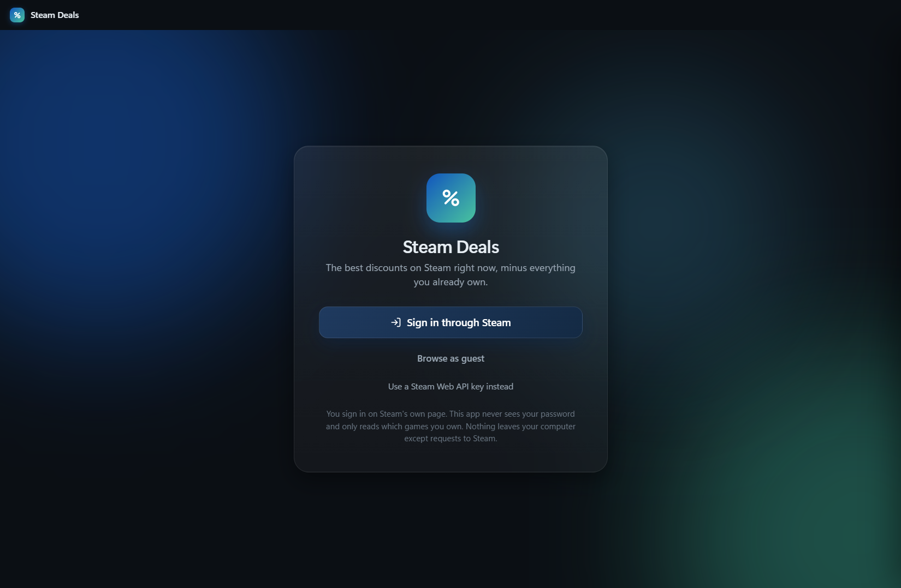
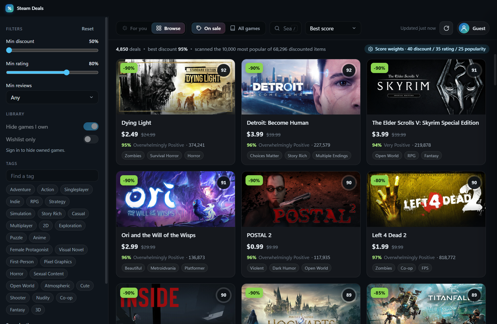

# Steam Deals

A Windows desktop app that finds the best current Steam discounts on games you don't already own.
Sign in with your Steam account, and the app hides your whole library (free-to-play included),
then ranks what's left by a score that blends discount depth, review rating, and popularity.




## Install

1. Download `Steam Deals Setup x.y.z.exe` from the Releases page.
2. Run it. Windows SmartScreen will say the publisher is unknown because the installer isn't code-signed.
   Click **More info → Run anyway**.
3. Pick an install folder (or keep the default) and finish. A Start Menu entry and desktop shortcut are created.

The app installs per-user and needs no admin rights. Uninstall from Windows Settings → Apps.

## Using it

- **Sign in through Steam** opens Steam's own login page in a window. Sign in there as usual, including Steam Guard.
  The app never sees your password. It only reads which games you own and what's on your wishlist.
- **Browse as guest** shows deals without hiding owned games.
- **Use a Steam Web API key instead** is for people who prefer not to sign in. Get a free key at
  <https://steamcommunity.com/dev/apikey>; your profile's Game details must be public.

Filters live in the left sidebar: minimum discount and rating, minimum review count, tags, hide-owned and wishlist-only.
Click any card for details and a score breakdown, plus buttons to open the store page in your browser or in the Steam client.

**Score** = 40% discount + 35% positive-review percentage + 25% popularity, where popularity is the review count on a
log scale relative to the most-reviewed game in your current results. Change the weights in Settings.

Settings also has the store region and language (prices follow the region), and a scan depth of 1,000, 3,000 or
6,000 games. The scan walks Steam's catalog of discounted items by popularity, so the top of the ranking is stable
even at the quick depth.

## Privacy

- Sign-in happens on Steam's page. The only cookie the app reads is the one that identifies your SteamID64.
- Your Steam session, settings, and caches stay in `%APPDATA%\Steam Deals` on your machine. Sign out wipes the session.
- The app talks only to Steam domains. No telemetry, no third-party services.

Not affiliated with Valve Corporation. Steam is a trademark of Valve Corporation.

## Development

Requires Node 20.11 or newer.

```bash
npm install
npm start               # run from source
npm run selftest        # hit the Steam endpoints from plain Node
npm run dist            # build release/Steam Deals Setup x.y.z.exe
```

Layout: `src/main` (Electron main process: window, Steam HTTP, sign-in, settings, cache), `src/preload.js`
(the only bridge to the UI), `src/renderer` (vanilla HTML/CSS/JS). `SPEC.md` describes the design in detail.

`scripts/make-icon.py` regenerates the icon (needs Python with Pillow). `scripts/cdp.mjs` drives a running
instance over the DevTools protocol for screenshots and inspection when started with `--remote-debugging-port=9222`.
