# Steam Deals

[](https://github.com/Drakey83/steam-deals/releases/latest)
[](https://github.com/Drakey83/steam-deals/releases)


Find Steam games you'll actually like and aren't already playing. Sign in with your Steam account and
it learns your taste from your library, weighted by how much you've played each game, then ranks the
current sales (or the whole catalog) by how well each game matches you, with a "because you played …"
explanation on every card. Everything you own is hidden. Play on a **Steam Deck or Steam Machine**? One switch
keeps only the games Valve rates Verified or Playable there, and every card shows its rating.

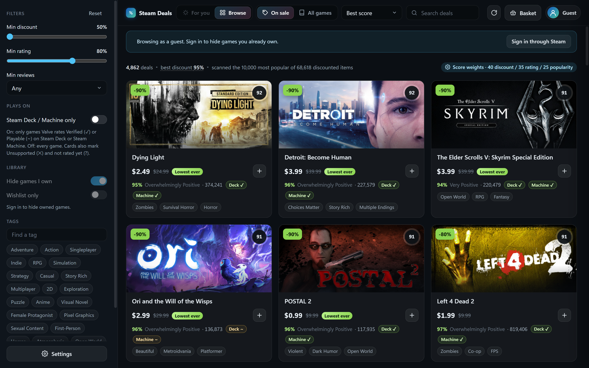

| | |
|---|---|
| 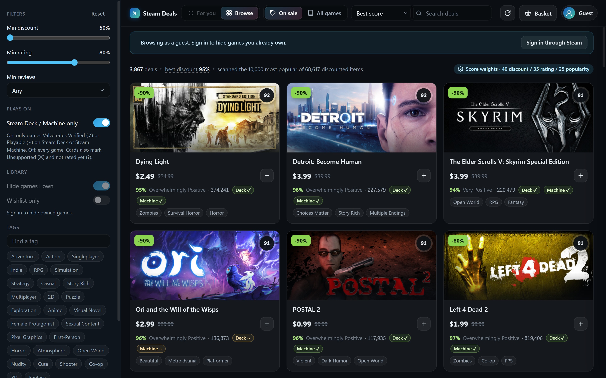 | 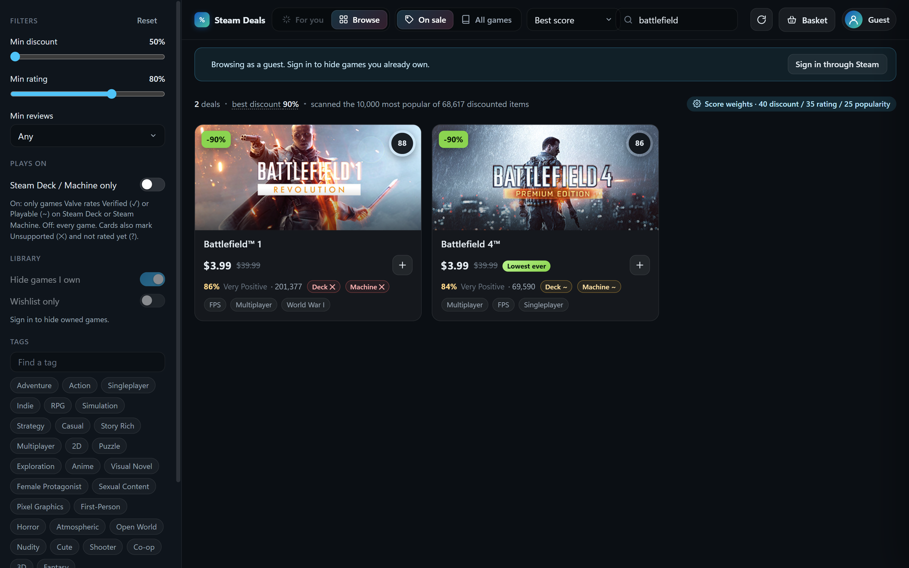 |
| 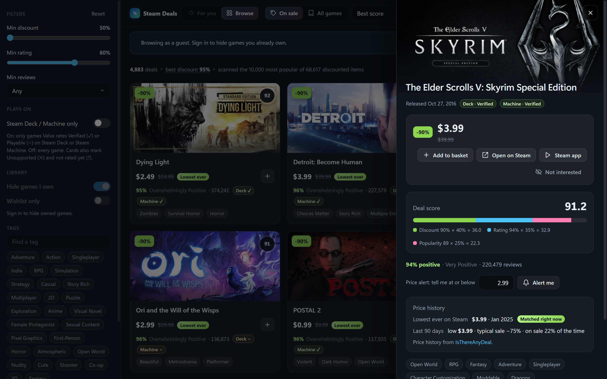 | 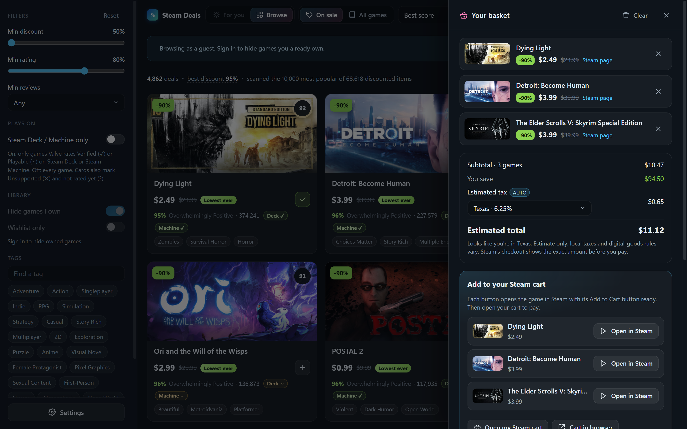 |
| 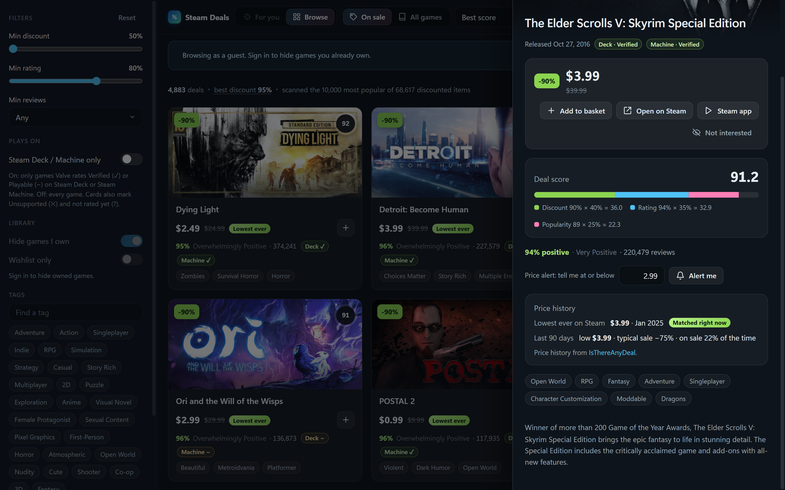 | 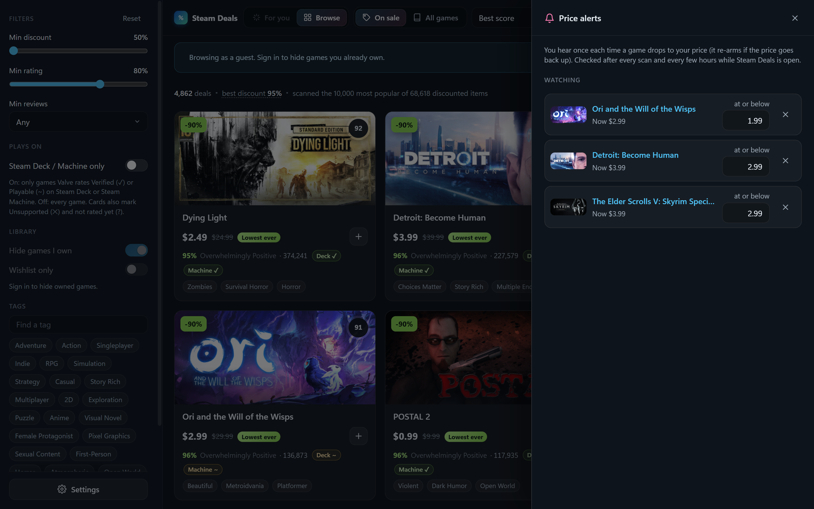 |

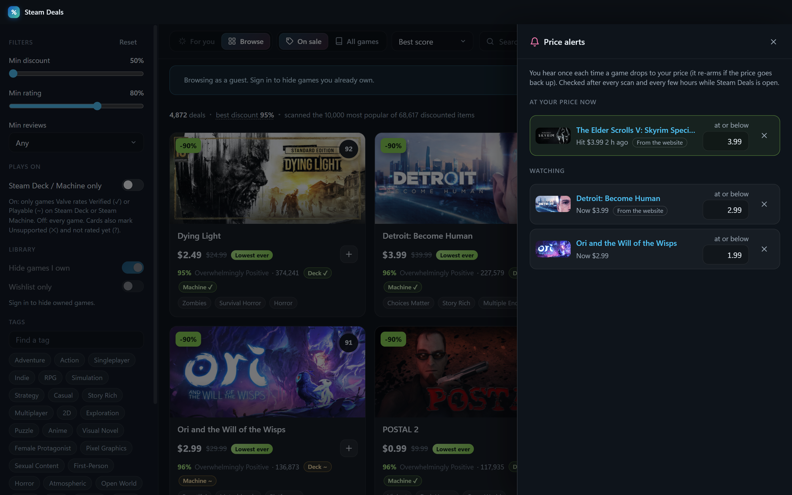

| Your taste, edited by hand | The basket total, with estimated tax |
|---|---|
| 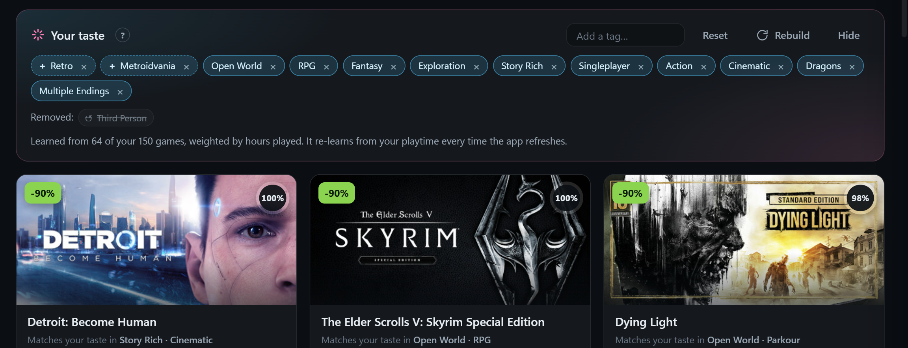 | 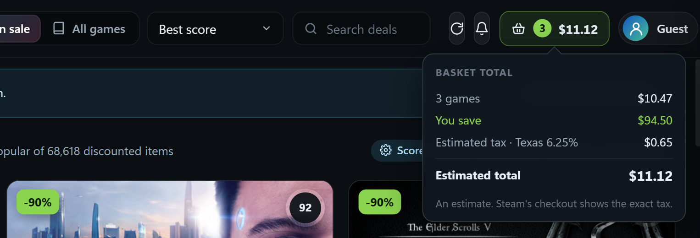 |

| Phone | Filters | Basket | Tablet |
|---|---|---|---|
| 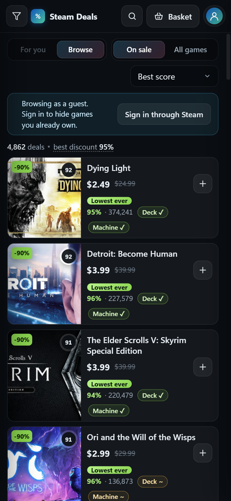 | 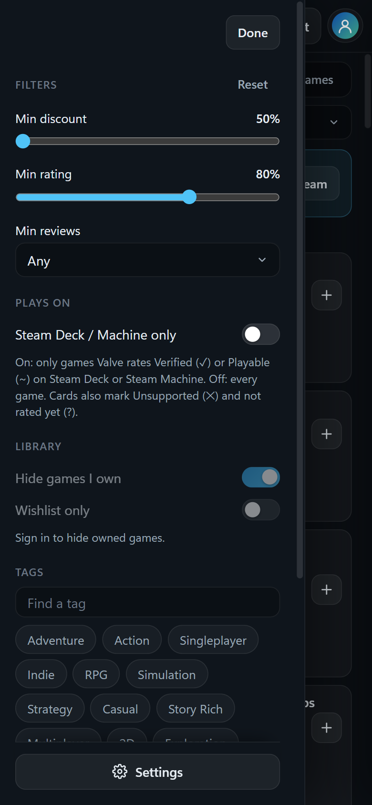 | 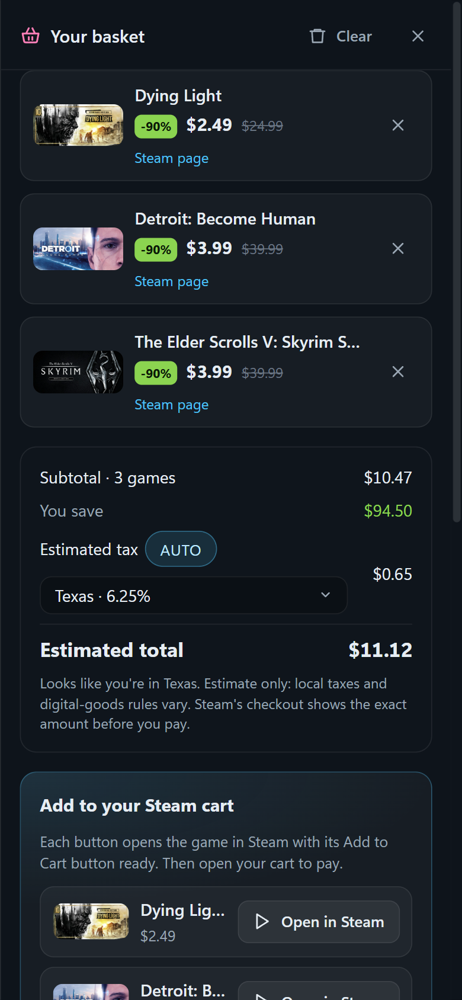 | 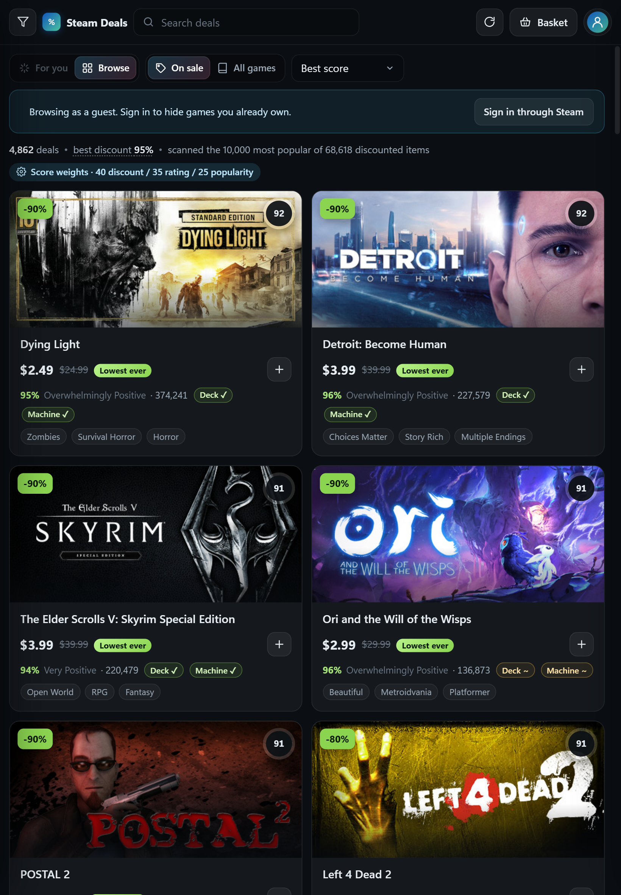 |

## Three ways to use it

| | What you need | Best for |
|---|---|---|
| **[Website](https://steamdeal.vercel.app)** | A browser | Trying it right now, on any computer or phone |
| **[Windows app](https://github.com/Drakey83/steam-deals/releases/latest)** | Windows 10 or 11 | Everyday use; works with private Steam profiles |
| **Run it yourself** | [Node.js](https://nodejs.org) 20.11+ | Running everything on your own machine, or tinkering |

### Website

Open **https://steamdeal.vercel.app**. Nothing to install. Sign in through Steam, paste your own
Steam Web API key, or browse as a guest. Signing in through Steam needs your profile's **Game details**
set to Public. Using your own key does not. On a phone or tablet, use your browser's **Add to Home Screen**
to keep it as an app. The layout adapts to the screen: on phones the games become a compact list under a slim
top bar, the filters open as a side sheet, and the view toggles scroll away with the content.

### Windows app

The app has two jobs.

- **On its own it is the whole thing.** Browse every sale minus what you own, get For-you picks learned from
  your library and playtime, collect games in a basket with a tax estimate, and have your **Steam cart kept in
  sync with that basket**: add a game and it is in your cart within seconds, remove it and it leaves the cart.
  Nothing is ever purchased; you pay in Steam's own checkout. Works with private Steam profiles.
- **With the website it is the bridge.** A browser is never allowed to touch a Steam cart, so the website
  (on your phone or anywhere) shares **one basket** with the app: whatever you add on your phone lands in your
  Steam cart through the app on your PC, live, from anywhere. Signed in through Steam on both, they connect by
  themselves; no code needed.

1. Download [`Steam-Deals-Setup.exe`](https://github.com/Drakey83/steam-deals/releases/latest/download/Steam-Deals-Setup.exe)
   from the [latest release](https://github.com/Drakey83/steam-deals/releases/latest) and run it.
   Windows SmartScreen will warn that the publisher is unknown (the installer is not code-signed yet):
   choose **More info → Run anyway**. It installs for your user account; no admin rights needed.
2. **Sign in through Steam** once, on Steam's own login page inside the app.
3. On your phone or any browser, **sign in through Steam** on [steamdeal.vercel.app](https://steamdeal.vercel.app)
   and it syncs with the app automatically. Optional: turn on **Start with Windows** in Settings (it opens
   full screen at sign-in; turn on **Open closed to the tray** if you'd rather it start quietly in the tray).

After that the app keeps itself up to date. It checks GitHub for a new version a minute after it starts and every
six hours, downloads it in the background, and shows "Version x.y.z is ready" with **Restart to update**: in
Settings → Updates, in the tray menu, and in a message in the app. Restarting installs it quietly and reopens the
app; your basket and settings stay. **Check for updates** in the same places checks right away. (If you quit
instead, the update installs then.)

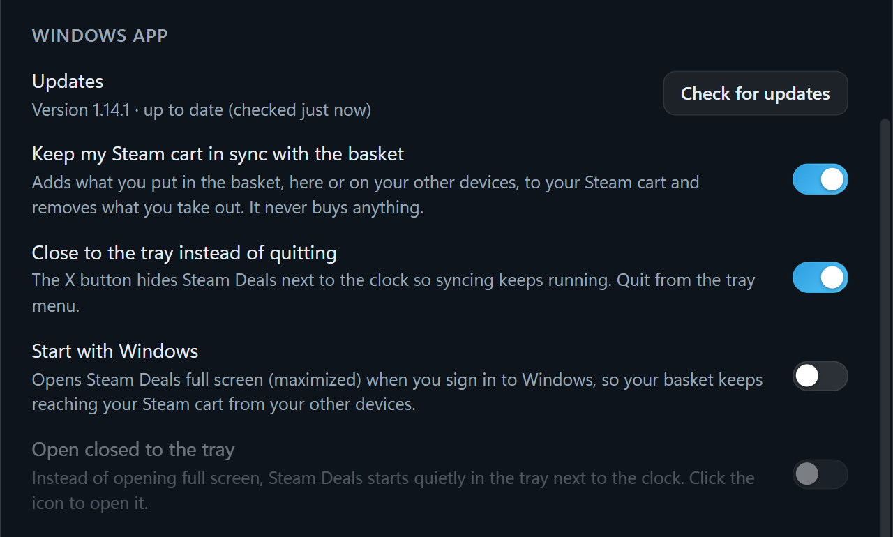

The X button hides the app to the tray so syncing keeps running; quit from the tray menu, or turn that off in
Settings. Clicking the tray icon minimizes the window, or brings it back. The [steamdeal.vercel.app/app](https://steamdeal.vercel.app/app) page explains all of this for
people who arrive from the website.

### Run it yourself

Download the code (green **Code** button → **Download ZIP**, or `git clone`), then in that folder:

```bash
npm install
```

Then either:

```bash
npm start
```

to run the desktop app from source (built and tested on Windows; Electron should also run it on macOS and Linux), or:

```bash
npm run web:local
```

to run the website on your own machine at http://localhost:3000. No accounts needed. The API-key and
guest options work straight away. To turn on "Sign in through Steam" locally, create a file named `.env`
in the folder with your own key and any long random string:

```
STEAM_API_KEY=your-32-character-key
SESSION_SECRET=any-random-string-at-least-32-characters-long
```

## Using it

- **Sign in through Steam** opens Steam's own login page in a window. Sign in there as usual, including Steam Guard.
  The app never sees your password. It only reads which games you own and what's on your wishlist. Leave
  **Remember me** ticked on Steam's page and you stay signed in for as long as the Steam website would keep you
  signed in (weeks to months): the app renews the session itself on launch and every few hours, the same way a
  browser does when you open the store. You only sign in again after changing your password or signing out.
- **Browse as guest** shows deals without hiding owned games.
- **Use a Steam Web API key instead** is for people who prefer not to sign in. Get a free key at
  <https://steamcommunity.com/dev/apikey>; your profile's Game details must be public.

Two toggles at the top:

- **For you / Browse.** For you ranks by how well each game matches your taste, blended with the deal score.
  Browse is the plain ranking by score. (For you needs a signed-in account.)
- **On sale / All games.** On sale shows only discounted games. All games covers the whole catalog, so For you
  becomes "the highest-rated games I'd probably like, whether or not they're on sale."

**Basket.** Press **+** on any game to collect sales. The basket shows the subtotal, what you're saving, an
estimated tax for your state or province (Steam adds US and Canadian sales tax at checkout; elsewhere prices
already include it), and the total. Nothing is purchased by Steam Deals: you review and pay in Steam's own
checkout, in the Steam app, the website, or on your phone, since the cart belongs to your account.

- In the **Windows app**, the basket *is* your Steam cart: games you add are put in the cart within seconds and
  games you remove are taken out again (only ones the app added; anything you put in by hand on Steam is left
  alone). Each row shows "In your Steam cart" once it's there. When you check out, the games you now own drop
  out of the basket. If you'd rather press a button, Settings → "Keep my Steam cart in sync" switches it off and
  the old **Send to my Steam cart** button (with Undo) comes back.
- On the **website**, a browser can't touch your cart, so the Windows app does it as the bridge:
  - **Sign in through Steam, and that's it.** Every phone, browser and Windows app signed in with the same Steam
    account shares one basket, your price alerts and Your taste, automatically. Nothing to type.
  - **Everything you choose is the same everywhere.** For you / Browse, On sale / All games, the sort, every
    sidebar filter (discount, rating, reviews, Steam Deck / Machine only, hide owned, wishlist only, tags), scan
    depth, the score weights, Not interested and what the app has learned from what you open and basket. Change one
    on any device and the others show it within about a second, both ways, so Your taste and For you come out the
    same too. (Store region and language stay per device, for a phone abroad.)
  - **Not signed in?** Pair with a code instead: in the app's basket press **Pair a phone or browser** (or **Add a
    device without signing in**), then type the six-letter code on the website's basket under **Already have it?**.
  - From then on it's **one shared basket**. Add or remove a game on your phone and it appears in, or leaves,
    your Steam cart through the PC within seconds. No send button. The website shows your PC's status and,
    per game, whether it's in the cart yet. Works from anywhere, mobile data included; the PC just needs to be
    on with the app running (the tray is fine). If the PC is off, the basket waits and syncs when it's back.
  - Syncing stores only the shared basket, alerts and preferences (game ids, names, prices, tag ids, filter
    choices) under a random
    channel id. With account sync that id is derived from your Steam ID with the site's secret; no account
    details are stored.
  - Without the app, each game in the basket has an **Open in Steam** button that opens its own Add to Cart
    button in the Steam client or the Steam mobile app.

**It remembers.**
- **Not interested.** The eye button on a card (or in a game's details) hides it, and games that share what you
  dismissed rank lower in For you. Settings lists them with Restore.
- **Price alerts.** “Alert me” in a game's details, or from your wishlist in the alerts panel: you hear once each
  time it drops to your price (a Windows notification from the app, a badge on the website). Paired with the
  Windows app, alerts you set on the website are checked by the app in the tray, so you get a Windows
  notification even with the website closed.
- **Price history.** A “Lowest ever” badge and a 90-day summary (low, typical sale) in a game's details, from
  [IsThereAnyDeal](https://isthereanydeal.com), shown only when there's real data behind it.
- **Learns from what you do.** Games you open, basket, dismiss or buy fine-tune For you over time; your library
  always has the bigger say, and Settings has “Reset my recommendations”.
- **Hints everywhere.** Hover any button, badge, filter or tag to see what it does (on a phone or tablet, press and
  hold it; tap a ? for help). The basket button shows how its total is made up.
- **Edit your taste.** In For you, drag a tag from Tags onto “Your taste” to add it, or drag one of your taste's
  tags back onto Tags (or click its ×) to remove it. You can also type a tag into “Add a tag”. Removed tags can be
  restored with a click, Reset undoes every change, and the ? next to “Your taste” explains it all on hover.
  Paired with the Windows app, your edits are shared: change them on either side and the other follows.

Filters live in the left sidebar: minimum discount (all the way down to **Any**, for every game on sale; the app
scans again for the smaller sales when you go below 50%), minimum rating and review count, **Steam Deck / Machine
only** (on: only games Valve rates Verified or Playable on Steam Deck or Steam Machine; off: every game. Cards carry a
Deck ✓ / Machine ✓ badge for Verified and ~ for Playable, and the details panel lists every published rating), tags,
hide-owned and **Wishlist only**. Wishlist only shows every game on your wishlist that's on sale, at any discount:
the app looks your wishlist up on Steam directly, and the minimums don't apply to games you already chose.
Click any card for details, a score breakdown, and why it matched you, plus buttons to open the store page in your
browser or in the Steam client.

**How the taste profile works.** The app reads your library with playtime, picks the games you've played most
(plus everything played in the last two weeks), and builds a weighted profile of Steam's store tags from them.
Each candidate game's tags are compared against that profile relative to the whole catalog, so ubiquitous tags like
"Singleplayer" don't count for much while distinctive ones do. The profile is re-checked on every launch and refresh:
when your library or hours change, it's rebuilt, so it keeps up with what you're playing now. Tags for games it has
already seen are cached, so a rebuild is a handful of requests. You can collapse the "Your taste" panel with Hide.

**Deal score** = 40% discount + 35% positive-review percentage + 25% popularity, where popularity is the review
count on a fixed log scale (1,000 reviews = 50, a million or more = 100), so a game's score doesn't change with what
else is loaded. In All-games mode the discount
term drops out. The For-you ranking blends taste match and deal score; the "Taste over deal" slider in Settings
sets the mix. All weights are adjustable.

Settings also has the store region and language (prices follow the region) and the scan depth: 3,000, 10,000 or
25,000 most-popular items, or everything on sale (about 70,000 items, two to three minutes). Results stream in as
pages arrive, so the first cards show up in about a second at any depth.

## Privacy

- Sign-in always happens on Steam's own page. Neither version ever sees your password.
- **Windows app:** the only cookie it reads is the one that identifies your SteamID64. Your Steam session,
  settings, and caches stay in `%APPDATA%\Steam Deals`. Sign out wipes the session. It talks only to Steam,
  plus steamdeal.vercel.app for two things: one request to guess your state or province for the basket's tax
  estimate (nothing stored), and syncing with your other devices: the shared basket, price alerts and preferences
  (game ids, names, prices, tag ids and filter choices, and which games are in your cart; never account details). To join your
  account's sync channel, the app shows the site its short-lived Steam store token once; the site checks it with
  Steam and doesn't keep it. "Unpair all devices" deletes a code pairing's shared data from the site.
- **Basket tax estimate:** the region is guessed from your connection's location and can be changed in the basket.
- **Website:** settings and any API key you add stay in your browser. Your key is passed through to Steam
  and never stored on the server. The visitor count is anonymous: one random id per browser, nothing tied
  to you or your Steam account. No ads, no tracking.

Not affiliated with Valve Corporation. Steam is a trademark of Valve Corporation.

## Development

Requires Node 20.11 or newer.

```bash
npm install
npm start               # run from source
npm run check           # lint, import check and unit tests
npm run dist            # check, then build release/Steam Deals Setup x.y.z.exe
```

The interface is plain ES modules shared by the desktop app and the website, split into small files by
layer: pure logic (unit-tested), data loading, shared widgets and views. The Windows app's main process is
split the same way (window, tray, deep links, IPC handlers per feature, the cart-sync engine).
[ARCHITECTURE.md](ARCHITECTURE.md) maps every folder; `SPEC.md` describes the design in detail.

**Website** (`web/`): static page plus serverless functions on Vercel's free Hobby plan. `web/src/web-api.js`
(with `web/src/browser-api/`) implements the same interface the desktop preload exposes, backed by `web/api/*`. Deal pages are cached at
Vercel's edge for three hours, so every visitor shares one scan. "Sign in through Steam" is Steam's OpenID
login; it is enabled when the project has `STEAM_API_KEY` and `SESSION_SECRET` (32+ chars) set as
environment variables. A visitor's own API key stays in their browser and is passed through to Steam only.

```bash
npm run web:local       # run the website locally (plain Node, no accounts)
npm run web:build       # assemble web/public from the shared sources
npm run web:deploy      # check, build and deploy to production (needs `vercel login` and a linked project)
```

`scripts/make-icon.py` regenerates the icon (needs Python with Pillow). `scripts/cdp.mjs` drives a running
instance over the DevTools protocol for screenshots and inspection when started with `--remote-debugging-port=9222`.
